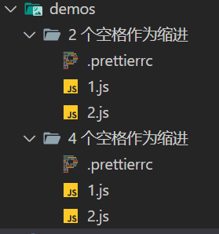

# [0001. 配置 tab 宽度](https://github.com/Tdahuyou/prettier/tree/main/0001.%20%E9%85%8D%E7%BD%AE%20tab%20%E5%AE%BD%E5%BA%A6)

- 📝 summary
  - 通过 tabWidth 来配置宽度。
  - 本节搭建了一个简单的 demo 环境（一个用于测试的 .js 文件，一个用于填写 prettier 的配置文件），测试 prettier 的配置效果。后续可以快速测试一些简单的配置字段效果。

## 🔗 links

- https://prettier.io/docs/en/options

## 💻 demo - 测试缩进配置 tabWidth

- 在 demo 目录中，分别在配置文件中将 tabWidth 配置为 4 和 2，测试格式化的效果。其中 1.js 中存放的是未格式化的代码，将代码复制到 2.js 中，然后按下 `alt shift f` 格式化。将会得到 2.js 中的内容。
  - 

```json
// .prettierrc
{
    "tabWidth": 2
}
```

```js
// 1.js
// 未格式化的文件
function sum(a,b){
return a+b;
}
```

- 按下 `alt shift f` 格式化，格式化后的结果如下：

```js
// 2.js
// 已格式化的文档
function sum(a, b) {
  return a + b;
}
```